# 02 - Architecture

## 1. Architectural Philosophy & Principles

The **Batanes Niche Job Portal** is designed as a **Modular Monolith** with clear logical and physical boundaries. The architecture balances developer ergonomics, deterministic behavior, testability, and operational simplicity.

### Guiding Principles

1. **Layered Separation of Concerns**:
   - Every request passes through well-defined architectural layers: **HTTP Router -> Domain Service -> Repository -> Data Model**.
   - Business rules, scoring algorithms, and security checks reside strictly within Domain Services, never inside route handlers or database models.
2. **Explicit Layer Decoupling**:
   - The public-facing client is a modern Single Page Application (SPA) built with React 18 and Vite.
   - The administrative interface is a server-rendered Jinja2 web application completely hosted and managed by FastAPI under `/admin`.
   - The frontend SPA does not bundle, import, or leak any administrative views or capabilities.
3. **Deterministic Business Logic**:
   - All critical calculations (e.g., profile completeness, geographic distance scoring, skill match percentage) use pure, predictable mathematical algorithms rather than probabilistic or black-box components.
4. **Resilient Data Access**:
   - Database operations use the **Repository Pattern** with SQLAlchemy 2.0.
   - Repositories encapsulate all query construction, filtering, pagination, and soft-delete enforcement, preventing SQL leakage into services.

---

## 2. Comprehensive System Architecture Diagram

The diagram below illustrates the end-to-end multi-tier architecture, showing how public web clients, administrators, the FastAPI application, internal domain layers, and external services interact.

```mermaid
flowchart TB
    subgraph ClientLayer["Client & Presentation Tier"]
        PublicUser["Public User<br/>(Job Seeker / Employer)"]
        AdminUser["System Administrator"]
        
        subgraph PublicSPA["Public Frontend SPA (Port 5173 / Nginx)"]
            ReactApp["React 18 Application<br/>(Vite + Tailwind CSS)"]
            AuthCtx["AuthContext<br/>(In-Memory Access Token)"]
            AxiosClient["Axios API Client<br/>(Silent Refresh Interceptor)"]
        end

        subgraph AdminBrowser["Admin Web Browser"]
            AdminSessionCookie["Signed Session Cookie<br/>(HttpOnly, SameSite=Lax)"]
            AdminCsrfCookie["CSRF Token Cookie"]
        end
    end

    subgraph GatewayLayer["Reverse Proxy & Gateway Tier"]
        Nginx["Nginx Reverse Proxy (Port 80/443)"]
    end

    subgraph BackendApp["Backend Application Tier (FastAPI - Port 8000)"]
        subgraph MiddlewareStack["Core Middleware Stack"]
            CORSMiddleware["CORSMiddleware"]
            LoggingMiddleware["StructuredLoggingMiddleware"]
            ErrorHandler["Global Exception Handler"]
            RateLimiter["SlowAPI Rate Limiter"]
        end

        subgraph APIRoutes["REST API Layer (/api/v1)"]
            AuthRouter["Auth Router"]
            UserRouter["Users Router"]
            JobRouter["Jobs Router"]
            AppRouter["Applications Router"]
            RecRouter["Recommendations Router"]
            SavedRouter["Saved Jobs Router"]
            NotifRouter["Notifications Router"]
            MetaRouter["Meta Router"]
            HealthRouter["Health & Ready Probes"]
        end

        subgraph AdminPortal["Server-Rendered Admin Portal (/admin)"]
            AdminRoutes["Admin Routes & Controllers"]
            Jinja2Engine["Jinja2 Template Engine"]
            AdminTemplates["Admin Templates & Partials"]
            AdminAuthGuard["Admin Session & CSRF Guard"]
        end

        subgraph DomainServices["Domain Service Layer (Business Logic)"]
            AuthService["AuthService"]
            UserService["UserService"]
            JobService["JobService"]
            AppService["ApplicationService"]
            RecService["RecommendationService"]
            SavedService["SavedJobsService"]
            NotifService["NotificationService"]
            GeoService["GeographyService"]
            AuditService["AuditService"]
            ErrorLogService["ErrorLoggingService"]
            EmailService["EmailDeliveryService"]
        end

        subgraph RepositoryLayer["Data Access / Repository Layer"]
            UserRepo["UserRepository"]
            JobRepo["JobRepository"]
            AppRepo["ApplicationRepository"]
            TokenRepo["TokenRepository"]
            ResetRepo["PasswordResetRepository"]
            NotifRepo["NotificationRepository"]
            SavedRepo["SavedJobRepository"]
            AuditRepo["AuditLogRepository"]
            ErrorRepo["ErrorReportRepository"]
        end
    end

    subgraph PersistenceLayer["Persistence & Storage Tier"]
        DB[(Relational Database<br/>PostgreSQL 16 / SQLite)]
        UploadsVolume["Persistent Uploads Storage<br/>(/app/uploads)"]
    end

    subgraph ExternalServices["External Services Tier"]
        SMTPServer["SMTP Mail Server<br/>(Gmail / SMTP Relay)"]
    end

    %% Client traffic
    PublicUser --> ReactApp
    ReactApp --> AuthCtx
    AuthCtx --> AxiosClient
    AxiosClient --> Nginx

    AdminUser --> AdminBrowser
    AdminBrowser --> Nginx

    %% Reverse proxy dispatching
    Nginx -- "/api/*" --> MiddlewareStack
    Nginx -- "/admin*" --> MiddlewareStack
    Nginx -- "/static/*" --> MiddlewareStack
    Nginx -- "/*" --> ReactApp

    %% Middleware flow
    MiddlewareStack --> APIRoutes
    MiddlewareStack --> AdminPortal

    %% API to Domain
    AuthRouter --> AuthService
    UserRouter --> UserService
    JobRouter --> JobService
    AppRouter --> AppService
    RecRouter --> RecService
    SavedRouter --> SavedService
    NotifRouter --> NotifService
    MetaRouter --> GeoService
    HealthRouter --> DB

    %% Admin to Domain & Templates
    AdminPortal --> AdminAuthGuard
    AdminAuthGuard --> AdminRoutes
    AdminRoutes --> Jinja2Engine
    Jinja2Engine --> AdminTemplates
    AdminRoutes --> UserService
    AdminRoutes --> JobService
    AdminRoutes --> AuditService
    AdminRoutes --> ErrorLogService

    %% Domain Cross-cutting
    AuthService --> EmailService
    AuthService --> AuditService
    AuthService --> GeoService
    JobService --> GeoService
    JobService --> AuditService
    AppService --> NotifService
    RecService --> GeoService
    ErrorHandler --> ErrorLogService

    %% Domain to Repositories
    AuthService --> UserRepo
    AuthService --> TokenRepo
    AuthService --> ResetRepo
    UserService --> UserRepo
    JobService --> JobRepo
    AppService --> AppRepo
    AppService --> JobRepo
    AppService --> NotifRepo
    RecService --> JobRepo
    RecService --> UserRepo
    SavedService --> SavedRepo
    NotifService --> NotifRepo
    AuditService --> AuditRepo
    ErrorLogService --> ErrorRepo

    %% Repositories to DB
    UserRepo --> DB
    JobRepo --> DB
    AppRepo --> DB
    TokenRepo --> DB
    ResetRepo --> DB
    NotifRepo --> DB
    SavedRepo --> DB
    AuditRepo --> DB
    ErrorRepo --> DB

    %% External Connections
    EmailService --> SMTPServer
    BackendApp --> UploadsVolume
```



---

## 3. Tier & Layer Responsibilities

### 3.1 Presentation Tier
- **Public React SPA (`frontend/`)**:
  - Built with React 18, Vite, TypeScript, and Tailwind CSS.
  - Consumes the `/api/v1` REST API using Axios.
  - Manages public guest routes, seeker dashboards, employer portals, job search views, and candidate directory search.
  - Keeps JWT access tokens exclusively in memory; delegates persistent sessions to a rotating refresh token stored in `localStorage`.
- **Administrative Portal (`backend/app/admin/`)**:
  - Built with server-side Jinja2 templates.
  - Consumes Domain Services and Repositories directly within the Python process.
  - Renders dashboard analytics, user moderation tables, job audit screens, and system logs.
  - Authenticated via signed HttpOnly session cookies (`batanes_admin_session`) and double-submit CSRF cookies (`batanes_admin_csrf`).

### 3.2 Gateway & Reverse Proxy Tier (`docker/nginx.conf`)
- Acts as the single entry point in production environments (Port 80/443).
- Directs `/api/` traffic to the FastAPI backend.
- Directs `/admin` traffic to the FastAPI backend.
- Serves static assets (`/assets/`) with long-term immutable caching headers (`max-age=31536000`).
- Serves the compiled React `index.html` for all client-side routes with fallback routing (`try_files $uri $uri/ /index.html`).
- Injects standard production security headers (`X-Frame-Options`, `X-Content-Type-Options`, `Referrer-Policy`).

### 3.3 Backend API Layer (`backend/app/api/v1/`)
- Pure HTTP translation boundary: parses request payloads, deserializes JSON via Pydantic v2, checks route-level permissions, and dispatches to Domain Services.
- Routers contain zero SQL queries, zero scoring logic, and zero direct entity mutations.
- Enforces rate limits using SlowAPI.
- Serializes domain outputs into strictly typed Pydantic response models.

### 3.4 Domain Service Layer (`backend/app/services/`)
- Encapsulates all business rules, orchestration workflows, and invariant enforcement.
- Key Domain Services:
  - `AuthService`: Registration, credential verification, token issuance/rotation, compromise detection, and OTP generation.
  - `UserService`: Profile completeness scoring, profile updates, sanitized candidate searches.
  - `JobService`: Vacancy creation, updating, soft-deletion, and search filtering.
  - `ApplicationService`: Application submission, status transitions, duplicate prevention, and applicant contact privacy authorization.
  - `RecommendationService`: Deterministic two-tier matching combining skill overlap and geographic transit scores.
  - `GeographyService`: Validation against the canonical 3-island, 6-municipality, 29-barangay hierarchy.
  - `NotificationService`: In-app notification creation, retrieval, and read status management.
  - `AuditService`: Append-only audit trail generation with automated secrets scrubbing.
  - `ErrorLoggingService`: Unhandled 500 exception persistence with request scrubbing.
  - `EmailDeliveryService`: SMTP email dispatching with graceful development simulation fallback.

### 3.5 Repository Layer (`backend/app/repositories/`)
- Encapsulates database operations using SQLAlchemy 2.0 ORM sessions.
- Enforces data integrity: active application duplicate checks, soft-delete filtering (`deleted_at IS NULL`), token hash lookups, and transaction flushes.
- Shields Domain Services from underlying SQL query mechanics and database dialect nuances.

### 3.6 Persistence Tier
- **Production**: PostgreSQL 16 relational database with connection pooling and WAL archiving.
- **Local Development & CI Testing**: SQLite (`sqlite:///./batanes_niche.db` or in-memory `sqlite:///:memory:`).
- **File Storage**: Local filesystem volume mounted at `/app/uploads` for resume files and user avatars.

---

## 4. Cross-Cutting Concerns

### 4.1 Global Exception & Error Handling
- Handled via `backend/app/middleware/error_handler.py`.
- `HTTPException` instances are translated into structured JSON responses:
  ```json
  {
    "detail": "Descriptive, client-safe error message"
  }
  ```
- Unhandled 500 server errors are intercepted before reaching the client:
  - The stack trace, endpoint, username, and sanitized request body are persisted into the `error_reports` table via `ErrorLoggingService`.
  - A clean, generic HTTP 500 response is returned to the client:
    ```json
    {
      "detail": "An internal server error occurred. Please try again later."
    }
    ```
  - Internal server stack traces and technical infrastructure terms are strictly prevented from leaking to the browser.

### 4.2 Logging & Auditing
- **Structured HTTP Logging**: `StructuredLoggingMiddleware` logs method, path, status code, IP address, and execution duration for every HTTP transaction.
- **Security & Business Auditing**: `AuditService` records high-risk actions (`USER_SUSPENDED`, `JOB_DISABLED`, `PASSWORD_RESET_COMPLETE`, `REFRESH_TOKEN_COMPROMISE_DETECTED`) into the append-only `audit_logs` table.
- **Automatic Secrets Scrubbing**: Both audit logs and error reports execute recursive scrubbing to replace sensitive fields (`password`, `token`, `otp`, `secret`, `hash`) with `[REDACTED]`.

---

## 5. Architectural Boundary Constraints

1. **Frontend Cannot Access Admin Routes**: The React application has no knowledge of `/admin` endpoints, schemas, or templates.
2. **Repositories Cannot Call Services**: Dependencies flow strictly downward: `Router -> Service -> Repository -> Model`.
3. **Database Cannot Store Unhashed Secrets**: Passwords must be bcrypt-hashed; refresh tokens must be SHA-256 hashed; password reset OTPs must be bcrypt-hashed.
4. **No Realtime Sockets or Threads**: Communication is strictly request-response over HTTP/HTTPS.

---

## 6. Next Steps

- For details on the repository layout and file locations, see [**03-Repository-Structure.md**](./03-Repository-Structure.md).
- For complete table schemas and relationships, see [**04-Database-and-ERD.md**](./04-Database-and-ERD.md).
- For the REST API contract and route specifications, see [**05-API-Architecture.md**](./05-API-Architecture.md).
