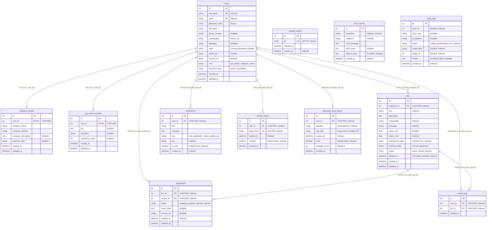

# 04 - Database and Entity-Relationship Diagram (ERD)

## 1. Relational Database Overview

The **Batanes Niche Job Portal** database schema is implemented with **SQLAlchemy 2.0** and managed via **Alembic migrations** (definitive baseline migration: `cf8c97336bac_initial_12_tables.py`).

The schema comprises **12 core relational tables** categorized into four functional groups:
1. **Identity & User Profiles**: `users`, `employer_profiles`, `job_seeker_profiles`.
2. **Employment Marketplace**: `jobs`, `applications`, `saved_jobs`.
3. **User Engagement & Comms**: `notifications`.
4. **Security, Observability & Auditing**: `refresh_tokens`, `revoked_tokens`, `password_reset_tokens`, `error_reports`, `audit_logs`.

---

## 2. Mermaid Entity-Relationship Diagram (ERD)

---

## 3. Table-by-Table Architectural Specifications

### 3.1 `users`
- **Purpose**: Core entity for all platform actors.
- **Constraints**:
  - `username` UNIQUE NOT NULL.
  - `email` UNIQUE NOT NULL.
  - `role` IN (`'job_seeker'`, `'employer'`, `'admin'`).
  - `account_status` IN (`'active'`, `'suspended'`).
- **Indexes**: `ix_users_id`, `ix_users_username`, `ix_users_email`, `ix_users_role`.
- **Soft Deletion**: None; suspended via `account_status = 'suspended'`.
- **Permissions**:
  - `CREATE`: Public registration (`job_seeker`, `employer`) or Admin CLI (`admin`).
  - `READ`: Authenticated user reads own profile; Public reads sanitized summaries without email/phone.
  - `UPDATE`: Owner or Administrator.
  - `DELETE`: Admin only.

### 3.2 `employer_profiles`
- **Purpose**: 1-to-1 extension table storing business metadata for employers.
- **Foreign Key**: `user_id` references `users(id)` ON DELETE CASCADE. Unique constraint enforces 1-to-1 relationship (`uq_employer_profiles_user_id`).
- **Indexes**: `ix_employer_profiles_id`, `ix_employer_profiles_user_id`.
- **Permissions**: Created automatically during employer registration; updated by employer owner or admin.

### 3.3 `job_seeker_profiles`
- **Purpose**: 1-to-1 extension table storing vocational background for job seekers.
- **Foreign Key**: `user_id` references `users(id)` ON DELETE CASCADE. Unique constraint enforces 1-to-1 relationship (`uq_job_seeker_profiles_user_id`).
- **Indexes**: `ix_job_seeker_profiles_id`, `ix_job_seeker_profiles_user_id`.
- **Permissions**: Created automatically during seeker registration; updated by seeker owner or admin.

### 3.4 `jobs`
- **Purpose**: Job vacancies posted by employers.
- **Foreign Key**: `employer_id` references `users(id)` ON DELETE CASCADE.
- **Constraints**:
  - `status` IN (`'active'`, `'closed'`).
  - `deleted_at`: Soft delete timestamp. Active jobs must have `deleted_at IS NULL`.
- **Indexes**: `ix_jobs_id`, `ix_jobs_employer_id`, `ix_jobs_title`, `ix_jobs_municipality`, `ix_jobs_employment_type`, `ix_jobs_status`, `ix_jobs_deleted_at`.
- **Permissions**:
  - `CREATE`: Authenticated employer.
  - `READ`: Public can view active, non-deleted jobs (`status = 'active' AND deleted_at IS NULL`). Employer can view own vacancies. Admin can view all.
  - `UPDATE`: Employer owner or Administrator.
  - `DELETE`: Soft-delete by employer owner or Administrator.

### 3.5 `applications`
- **Purpose**: Tracks job applications submitted by job seekers to specific vacancies.
- **Foreign Keys**:
  - `job_id` references `jobs(id)` ON DELETE CASCADE.
  - `seeker_id` references `users(id)` ON DELETE CASCADE.
- **Constraints**:
  - Unique Constraint: `uq_applications_job_seeker` on `(job_id, seeker_id)` strictly prevents duplicate applications by the same seeker to the same vacancy.
  - `status` IN (`'pending'`, `'accepted'`, `'rejected'`).
- **Indexes**: `ix_applications_id`, `ix_applications_job_id`, `ix_applications_seeker_id`, `ix_applications_status`, `ix_applications_created_at`.
- **Permissions**:
  - `CREATE`: Authenticated `job_seeker` (cannot apply to own posting).
  - `READ`: Seeker views own applications; Employer views applications for owned jobs.
  - `UPDATE`: Employer updates `status` (`pending` <-> `accepted`/`rejected`).
  - `DELETE`: Restricted.

### 3.6 `saved_jobs`
- **Purpose**: Bookmarked vacancies saved by job seekers.
- **Foreign Keys**:
  - `user_id` references `users(id)` ON DELETE CASCADE.
  - `job_id` references `jobs(id)` ON DELETE CASCADE.
- **Constraints**: Unique Constraint: `uq_saved_jobs_user_job` on `(user_id, job_id)`.
- **Indexes**: `ix_saved_jobs_id`, `ix_saved_jobs_user_id`, `ix_saved_jobs_job_id`.
- **Permissions**: Created and deleted exclusively by the owning job seeker.

### 3.7 `notifications`
- **Purpose**: In-app notifications generated for transactional workflow events.
- **Foreign Key**: `user_id` references `users(id)` ON DELETE CASCADE.
- **Indexes**: `ix_notifications_id`, `ix_notifications_user_id`, `ix_notifications_is_read`, `ix_notifications_created_at`.
- **Permissions**:
  - `CREATE`: Generated internally by domain services within transactional boundaries.
  - `READ`: Owning user.
  - `UPDATE`: Owning user marks notification as read (`is_read = True`).

### 3.8 `refresh_tokens`
- **Purpose**: Stateful refresh tokens for rotating JWT access sessions.
- **Foreign Key**: `user_id` references `users(id)` ON DELETE CASCADE.
- **Constraints**: `token_hash` UNIQUE NOT NULL (stores SHA-256 hash of raw token).
- **Indexes**: `ix_refresh_tokens_id`, `ix_refresh_tokens_user_id`, `ix_refresh_tokens_token_hash`, `ix_refresh_tokens_expires_at`, `ix_refresh_tokens_revoked`.
- **Security Rule**: Stored value is always `hashlib.sha256(raw_token).hexdigest()`. If a revoked token is submitted, all user tokens are immediately invalidated (compromise detection).

### 3.9 `revoked_tokens`
- **Purpose**: Blacklists JWT access token identifiers (`jti`) upon user logout.
- **Columns**: `jti` UNIQUE NOT NULL, `revoked_at`, `expires_at`.
- **Indexes**: `ix_revoked_tokens_id`, `ix_revoked_tokens_jti`, `ix_revoked_tokens_expires_at`.
- **Security Rule**: Evaluated by the `get_current_user` dependency to instantly invalidate access tokens prior to their 15-minute natural expiration.

### 3.10 `password_reset_tokens`
- **Purpose**: Stores hashed 6-digit numeric OTPs for password recovery.
- **Foreign Key**: `user_id` references `users(id)` ON DELETE CASCADE.
- **Columns**: `otp_hash` (bcrypt hash of 6-digit OTP), `identifier` (email), `expires_at` (15 minutes), `used` (boolean), `attempts_count` (integer).
- **Indexes**: `ix_password_reset_tokens_id`, `ix_password_reset_tokens_user_id`, `ix_password_reset_tokens_identifier`, `ix_password_reset_tokens_expires_at`, `ix_password_reset_tokens_used`.
- **Security Rule**: Invalidates after 15 minutes, upon first use, or after 5 failed verification attempts.

### 3.11 `error_reports`
- **Purpose**: Captures unhandled 500 exceptions with sanitized request metadata.
- **Columns**: `username`, `endpoint`, `error_message`, `stack_trace`, `request_data` (scrubbed).
- **Indexes**: `ix_error_reports_id`, `ix_error_reports_username`, `ix_error_reports_created_at`.
- **Permissions**: Written by `ErrorLoggingService`; viewed exclusively by administrators in `/admin/errors`.

### 3.12 `audit_logs`
- **Purpose**: Append-only log of critical security and administrative events.
- **Columns**: `actor_id`, `actor_role`, `ip_address`, `action`, `target_type`, `target_id`, `details` (scrubbed JSON).
- **Indexes**: `ix_audit_logs_id`, `ix_audit_logs_actor_id`, `ix_audit_logs_action`, `ix_audit_logs_target_type`, `ix_audit_logs_target_id`, `ix_audit_logs_created_at`.
- **Permissions**: Append-only by `AuditService`; viewed exclusively by administrators in `/admin/audit`.

---

## 4. Complete Database Data Dictionary

| Table Name | Column Name | Data Type | Nullable | PK | FK / References | Constraints & Defaults | Description & Usage | Sensitivity |
|---|---|---|---|---|---|---|---|---|
| `users` | `id` | INTEGER | NO | YES | - | AUTOINCREMENT | Primary surrogate key | System |
| `users` | `username` | VARCHAR(50) | NO | NO | - | UNIQUE, INDEXED | Public login handle | Public |
| `users` | `email` | VARCHAR(100) | NO | NO | - | UNIQUE, INDEXED | User email address | Private / PII |
| `users` | `password_hash` | VARCHAR(255) | NO | NO | - | bcrypt hash (rounds>=12) | Password verification hash | **Secret** |
| `users` | `full_name` | VARCHAR(100) | NO | NO | - | - | User legal / display name | Public |
| `users` | `phone_number` | VARCHAR(20) | YES | NO | - | - | Contact phone number | Private / PII |
| `users` | `municipality` | VARCHAR(50) | NO | NO | - | Canonical Batanes name | Residential municipality | Public |
| `users` | `barangay` | VARCHAR(50) | YES | NO | - | Canonical barangay | Residential barangay | Public |
| `users` | `skills` | TEXT | YES | NO | - | Comma-separated | Trade & vocational skills | Public |
| `users` | `profile_pic` | VARCHAR(255) | YES | NO | - | Relative URL path | Avatar image URL | Public |
| `users` | `resume_url` | VARCHAR(255) | YES | NO | - | Relative URL path | Uploaded PDF resume URL | Private |
| `users` | `role` | VARCHAR(20) | NO | NO | - | 'job_seeker'/'employer'/'admin' | RBAC system role | Public |
| `users` | `account_status` | VARCHAR(20) | NO | NO | - | DEFAULT 'active' ('active'/'suspended') | Account standing | Public |
| `users` | `created_at` | TIMESTAMP | NO | NO | - | DEFAULT utcnow() | Creation timestamp | System |
| `users` | `updated_at` | TIMESTAMP | NO | NO | - | DEFAULT utcnow() | Last update timestamp | System |
| `employer_profiles` | `id` | INTEGER | NO | YES | - | AUTOINCREMENT | Primary surrogate key | System |
| `employer_profiles` | `user_id` | INTEGER | NO | NO | `users(id)` | UNIQUE, ON DELETE CASCADE | 1-to-1 link to employer user | System |
| `employer_profiles` | `company_name` | VARCHAR(100) | NO | NO | - | - | Registered business name | Public |
| `employer_profiles` | `company_address` | VARCHAR(200) | NO | NO | - | - | Physical business address | Public |
| `employer_profiles` | `company_description` | TEXT | YES | NO | - | - | Business overview & history | Public |
| `employer_profiles` | `business_type` | VARCHAR(50) | YES | NO | - | - | Industry classification | Public |
| `employer_profiles` | `created_at` | TIMESTAMP | NO | NO | - | DEFAULT utcnow() | Creation timestamp | System |
| `employer_profiles` | `updated_at` | TIMESTAMP | NO | NO | - | DEFAULT utcnow() | Last update timestamp | System |
| `job_seeker_profiles` | `id` | INTEGER | NO | YES | - | AUTOINCREMENT | Primary surrogate key | System |
| `job_seeker_profiles` | `user_id` | INTEGER | NO | NO | `users(id)` | UNIQUE, ON DELETE CASCADE | 1-to-1 link to seeker user | System |
| `job_seeker_profiles` | `bio` | TEXT | YES | NO | - | - | Professional personal bio | Public |
| `job_seeker_profiles` | `education` | VARCHAR(100) | YES | NO | - | - | Educational attainment | Public |
| `job_seeker_profiles` | `experience_years` | INTEGER | NO | NO | - | DEFAULT 0 | Years in related trades | Public |
| `job_seeker_profiles` | `created_at` | TIMESTAMP | NO | NO | - | DEFAULT utcnow() | Creation timestamp | System |
| `job_seeker_profiles` | `updated_at` | TIMESTAMP | NO | NO | - | DEFAULT utcnow() | Last update timestamp | System |
| `jobs` | `id` | INTEGER | NO | YES | - | AUTOINCREMENT | Primary surrogate key | System |
| `jobs` | `employer_id` | INTEGER | NO | NO | `users(id)` | ON DELETE CASCADE, INDEXED | Vacancy owner | System |
| `jobs` | `title` | VARCHAR(100) | NO | NO | - | INDEXED | Job listing headline | Public |
| `jobs` | `description` | TEXT | NO | NO | - | - | Detailed job responsibilities | Public |
| `jobs` | `municipality` | VARCHAR(50) | NO | NO | - | INDEXED | Work location municipality | Public |
| `jobs` | `barangay` | VARCHAR(50) | YES | NO | - | - | Work location barangay | Public |
| `jobs` | `salary_min` | FLOAT | YES | NO | - | - | Minimum monthly compensation | Public |
| `jobs` | `salary_max` | FLOAT | YES | NO | - | - | Maximum monthly compensation | Public |
| `jobs` | `employment_type` | VARCHAR(50) | NO | NO | - | INDEXED (Full-time, Part-time, etc.) | Contract nature | Public |
| `jobs` | `required_skills` | TEXT | NO | NO | - | Comma-separated | Core skills required | Public |
| `jobs` | `status` | VARCHAR(20) | NO | NO | - | DEFAULT 'active' ('active'/'closed') | Listing availability | Public |
| `jobs` | `deleted_at` | TIMESTAMP | YES | NO | - | INDEXED (NULL = active) | Soft-delete timestamp | System |
| `jobs` | `created_at` | TIMESTAMP | NO | NO | - | DEFAULT utcnow() | Listing creation date | System |
| `jobs` | `updated_at` | TIMESTAMP | NO | NO | - | DEFAULT utcnow() | Last update timestamp | System |
| `applications` | `id` | INTEGER | NO | YES | - | AUTOINCREMENT | Primary surrogate key | System |
| `applications` | `job_id` | INTEGER | NO | NO | `jobs(id)` | ON DELETE CASCADE, INDEXED | Applied job vacancy | System |
| `applications` | `seeker_id` | INTEGER | NO | NO | `users(id)` | ON DELETE CASCADE, INDEXED | Applicant user | System |
| `applications` | `status` | VARCHAR(20) | NO | NO | - | DEFAULT 'pending', INDEXED | Status: pending/accepted/rejected | Private |
| `applications` | `cover_letter` | TEXT | YES | NO | - | - | Optional applicant statement | Private |
| `applications` | `resume_url` | VARCHAR(255) | YES | NO | - | - | Application-specific resume | Private |
| `applications` | `created_at` | TIMESTAMP | NO | NO | - | DEFAULT utcnow(), INDEXED | Submission timestamp | System |
| `applications` | `updated_at` | TIMESTAMP | NO | NO | - | DEFAULT utcnow() | Last update timestamp | System |
| `saved_jobs` | `id` | INTEGER | NO | YES | - | AUTOINCREMENT | Primary surrogate key | System |
| `saved_jobs` | `user_id` | INTEGER | NO | NO | `users(id)` | ON DELETE CASCADE, INDEXED | Seeker who saved | System |
| `saved_jobs` | `job_id` | INTEGER | NO | NO | `jobs(id)` | ON DELETE CASCADE, INDEXED | Bookmarked vacancy | System |
| `saved_jobs` | `created_at` | TIMESTAMP | NO | NO | - | DEFAULT utcnow() | Bookmarked timestamp | System |
| `notifications` | `id` | INTEGER | NO | YES | - | AUTOINCREMENT | Primary surrogate key | System |
| `notifications` | `user_id` | INTEGER | NO | NO | `users(id)` | ON DELETE CASCADE, INDEXED | Notification recipient | System |
| `notifications` | `title` | VARCHAR(150) | NO | NO | - | - | Short notification title | Private |
| `notifications` | `message` | TEXT | NO | NO | - | - | Full notification text | Private |
| `notifications` | `type` | VARCHAR(50) | NO | NO | - | new_application, etc. | Event taxonomy classification | System |
| `notifications` | `link` | VARCHAR(255) | YES | NO | - | - | Relative SPA navigation URL | System |
| `notifications` | `is_read` | BOOLEAN | NO | NO | - | DEFAULT FALSE, INDEXED | Read acknowledgment flag | Private |
| `notifications` | `created_at` | TIMESTAMP | NO | NO | - | DEFAULT utcnow(), INDEXED | Event generation timestamp | System |
| `refresh_tokens` | `id` | INTEGER | NO | YES | - | AUTOINCREMENT | Primary surrogate key | System |
| `refresh_tokens` | `user_id` | INTEGER | NO | NO | `users(id)` | ON DELETE CASCADE, INDEXED | Owning authenticated user | System |
| `refresh_tokens` | `token_hash` | VARCHAR(64) | NO | NO | - | UNIQUE, INDEXED (SHA-256) | Hash of raw refresh token | **Secret** |
| `refresh_tokens` | `expires_at` | TIMESTAMP | NO | NO | - | INDEXED (7 days) | Natural token expiration date | System |
| `refresh_tokens` | `revoked` | BOOLEAN | NO | NO | - | DEFAULT FALSE, INDEXED | Revocation flag | System |
| `refresh_tokens` | `created_at` | TIMESTAMP | NO | NO | - | DEFAULT utcnow() | Issuance timestamp | System |
| `revoked_tokens` | `id` | INTEGER | NO | YES | - | AUTOINCREMENT | Primary surrogate key | System |
| `revoked_tokens` | `jti` | VARCHAR(36) | NO | NO | - | UNIQUE, INDEXED (UUIDv4) | Blacklisted JWT Access JTI | System |
| `revoked_tokens` | `revoked_at` | TIMESTAMP | NO | NO | - | DEFAULT utcnow() | Logout timestamp | System |
| `revoked_tokens` | `expires_at` | TIMESTAMP | NO | NO | - | INDEXED (Access token expiry) | Pruning cutoff date | System |
| `password_reset_tokens` | `id` | INTEGER | NO | YES | - | AUTOINCREMENT | Primary surrogate key | System |
| `password_reset_tokens` | `user_id` | INTEGER | NO | NO | `users(id)` | ON DELETE CASCADE, INDEXED | Requesting user | System |
| `password_reset_tokens` | `identifier` | VARCHAR(100) | NO | NO | - | INDEXED | Email address submitted | Private |
| `password_reset_tokens` | `otp_hash` | VARCHAR(255) | NO | NO | - | bcrypt hash of 6-digit OTP | Verification hash | **Secret** |
| `password_reset_tokens` | `expires_at` | TIMESTAMP | NO | NO | - | INDEXED (15 minutes) | OTP expiration timestamp | System |
| `password_reset_tokens` | `used` | BOOLEAN | NO | NO | - | DEFAULT FALSE, INDEXED | Single-use flag | System |
| `password_reset_tokens` | `attempts_count` | INTEGER | NO | NO | - | DEFAULT 0 | Failed verification counter | System |
| `password_reset_tokens` | `created_at` | TIMESTAMP | NO | NO | - | DEFAULT utcnow() | Request timestamp | System |
| `error_reports` | `id` | INTEGER | NO | YES | - | AUTOINCREMENT | Primary surrogate key | System |
| `error_reports` | `username` | VARCHAR(50) | YES | NO | - | INDEXED | User session if known | Private |
| `error_reports` | `endpoint` | VARCHAR(255) | YES | NO | - | - | HTTP method and path | System |
| `error_reports` | `error_message` | TEXT | NO | NO | - | - | Exception message | System |
| `error_reports` | `stack_trace` | TEXT | YES | NO | - | - | Sanitized Python stack trace | System |
| `error_reports` | `request_data` | TEXT | YES | NO | - | Secrets scrubbed | Sanitized request payload | System |
| `error_reports` | `created_at` | TIMESTAMP | NO | NO | - | DEFAULT utcnow(), INDEXED | Incident timestamp | System |
| `audit_logs` | `id` | INTEGER | NO | YES | - | AUTOINCREMENT | Primary surrogate key | System |
| `audit_logs` | `actor_id` | INTEGER | YES | NO | - | INDEXED | User ID who initiated action | System |
| `audit_logs` | `actor_role` | VARCHAR(20) | YES | NO | - | - | Role of actor at event time | System |
| `audit_logs` | `ip_address` | VARCHAR(45) | YES | NO | - | - | Client IPv4 or IPv6 | Private |
| `audit_logs` | `action` | VARCHAR(50) | NO | NO | - | INDEXED | Event action identifier | System |
| `audit_logs` | `target_type` | VARCHAR(50) | YES | NO | - | INDEXED | Entity affected (user, job, etc.) | System |
| `audit_logs` | `target_id` | INTEGER | YES | NO | - | INDEXED | ID of affected entity | System |
| `audit_logs` | `details` | TEXT | YES | NO | - | Secrets scrubbed JSON | Audit payload details | System |
| `audit_logs` | `created_at` | TIMESTAMP | NO | NO | - | DEFAULT utcnow(), INDEXED | Audit event timestamp | System |

---

## 5. Next Steps

- For details on how REST API endpoints interact with these entities, see [**05-API-Architecture.md**](./05-API-Architecture.md).
- To understand how refresh tokens and OTP tokens are validated, see [**06-Authentication-and-Security.md**](./06-Authentication-and-Security.md).
- For the analytical query patterns and data sensitivity guidelines, see [**16-Data-Analysis-Reference.md**](./16-Data-Analysis-Reference.md).
