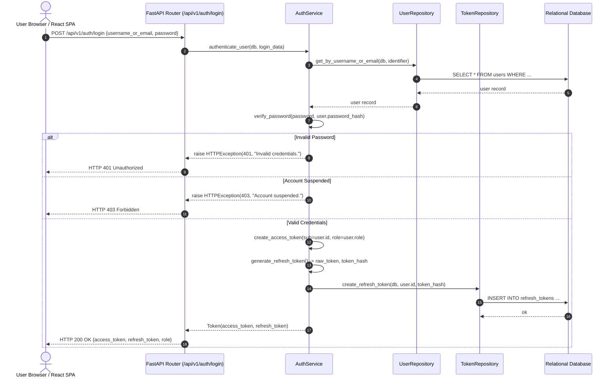
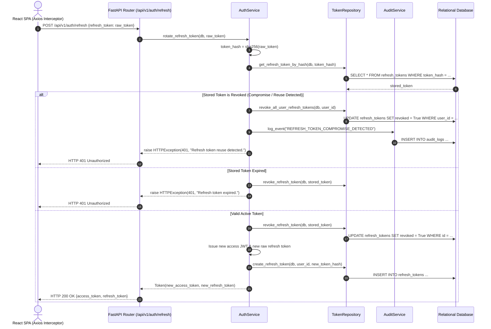
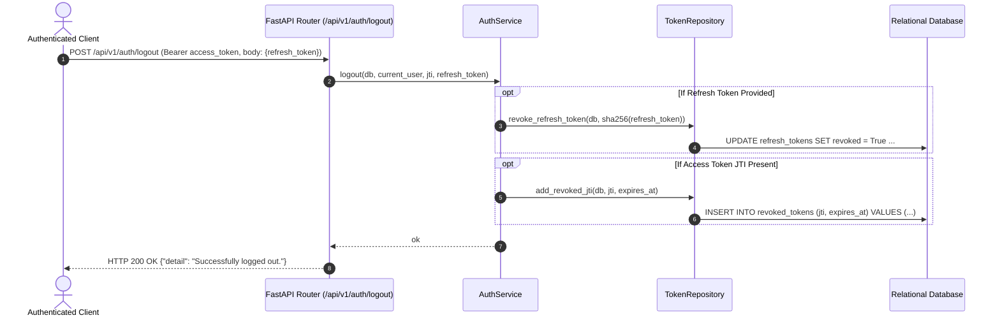
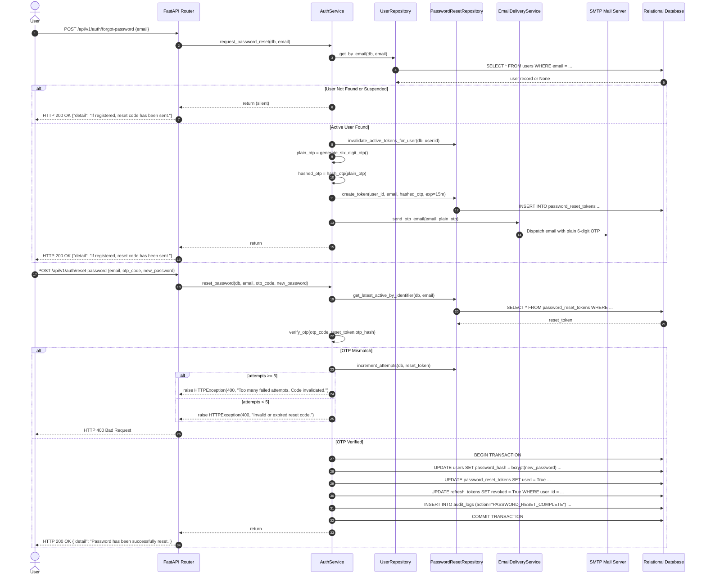

# 06 - Authentication and Security

## 1. Cryptographic Security Standards

Security in the **Batanes Niche Job Portal** is engineered with zero trust in client inputs and strict cryptographic standards across passwords, tokens, session cookies, and temporary credentials.

### Cryptographic Primitives

| Component | Primitive / Algorithm | Parameters / Work Factor | Storage Format |
|---|---|---|---|
| **User Passwords** | bcrypt | Work factor (salt rounds) = 12 | Modular Crypt Format (`$2b$12$...`) in `users.password_hash` |
| **Access Tokens** | HMAC-SHA256 (HS256) | High-entropy 64+ char secret key | Signed JWT string passed via `Authorization: Bearer` |
| **Refresh Tokens** | Raw: CSPRNG 32-byte URL-safe<br/>Stored: SHA-256 | `secrets.token_urlsafe(32)`<br/>`hashlib.sha256()` | 64-character lowercase hex digest in `refresh_tokens.token_hash` |
| **Password Reset OTP** | Raw: CSPRNG 6-digit numeric<br/>Stored: bcrypt | `secrets.randbelow(900000) + 100000`<br/>Work factor = 10 | Modular Crypt Format in `password_reset_tokens.otp_hash` |
| **Admin Session Cookie** | Itsdangerous Serializer | HMAC-SHA1 signed + timestamped | Signed cookie `batanes_admin_session` |
| **Admin CSRF Token** | CSPRNG 32-byte hex | `secrets.token_hex(32)` | Double-submit cookie `batanes_admin_csrf` |

---

## 2. JWT Access Token Architecture

Access tokens are short-lived, stateless credentials issued upon successful login or refresh token exchange.

### JWT Structure & Claims
```json
{
  "sub": "42",
  "username": "ivatan_guide",
  "role": "job_seeker",
  "jti": "550e8400-e29b-41d4-a716-446655440000",
  "iat": 1725450000,
  "exp": 1725450900
}
```

- `sub`: Subject ID (User ID as a string).
- `username`: Public username handle.
- `role`: Role claim (`job_seeker`, `employer`, `admin`).
- `jti`: JWT ID (UUIDv4) uniquely identifying the token instance. Enables immediate revocation upon logout.
- `iat`: Issued At timestamp (Unix epoch).
- `exp`: Expiration timestamp (15 minutes from issuance).

### Validation Pipeline (`backend/app/api/deps.py`)
1. Extract token from `Authorization: Bearer <token>` header.
2. Decode and verify signature with `JWT_SECRET_KEY` and `HS256`.
3. Verify `exp` claim against current UTC time.
4. Check whether `jti` exists in the `revoked_tokens` table. If present, immediately reject with `HTTP 401 Unauthorized`.
5. Retrieve user entity by `sub` (User ID). Verify `account_status == 'active'`. If suspended, immediately reject with `HTTP 403 Forbidden`.

---

## 3. Stateful Refresh Token Rotation & Reuse Detection

The system pairs short-lived stateless access tokens with **stateful rotating refresh tokens** stored in `refresh_tokens`.

### Rotation Lifecycle
1. When `/api/v1/auth/refresh` is called, the client provides the raw refresh token.
2. The server computes `hashlib.sha256(raw_token).hexdigest()` and queries `refresh_tokens`.
3. If not found or expired: Return `HTTP 401 Unauthorized`.
4. **Compromise Detection Rule**:
   - If the stored token record has `revoked == True`, an attacker or stale client is attempting to reuse an already-rotated token.
   - The server **immediately revokes all active refresh tokens** for that user (`TokenRepository.revoke_all_user_refresh_tokens`).
   - Appends an audit log: `REFRESH_TOKEN_COMPROMISE_DETECTED`.
   - Returns `HTTP 401 Unauthorized: Refresh token reuse detected. All sessions terminated for security.`
5. If the token is valid and unrevoked:
   - Mark current token `revoked = True`.
   - Generate a new 32-byte raw refresh token and compute its SHA-256 hash.
   - Insert new `refresh_tokens` record with 7-day expiration.
   - Issue new 15-minute JWT access token.
   - Return both to client.

---

## 4. Immediate Token Revocation & JTI Blacklisting

Standard stateless JWTs cannot be revoked until natural expiration without a revocation index. The Batanes Niche Portal solves this via the `revoked_tokens` table:

- Upon calling `/api/v1/auth/logout`:
  1. The access token's `jti` is inserted into `revoked_tokens` along with its expiration timestamp.
  2. The active refresh token is marked `revoked = True`.
- During every authenticated request, `get_current_user` performs an indexed O(1) check on `revoked_tokens.jti`. If found, the request is immediately rejected.
- Expired rows in `revoked_tokens` can be pruned safely after their `expires_at` date without compromising security.

---

## 5. Password Reset via 6-Digit Email OTP

Password recovery avoids long, error-prone token links in favor of an auditable, brute-force-resistant 6-digit OTP protocol.

### Step 1: Request Password Reset (`/api/v1/auth/forgot-password`)
- Client submits `{ "email": "user@example.com" }`.
- Server performs lookup. If the user does not exist or is suspended:
  - **Zero-Enumeration Guarantee**: Returns generic `{"detail": "If your account is registered, a 6-digit reset code has been sent to your email."}` without revealing user existence.
- If user exists and is active:
  - Invalidates any existing unexpired reset tokens for this user (`used = True`).
  - Generates a 6-digit numeric code: `secrets.randbelow(900000) + 100000`.
  - Computes bcrypt hash of the OTP (`hash_otp(plain_otp)`).
  - Inserts `password_reset_tokens` record with `expires_at = now() + 15 minutes` and `attempts_count = 0`.
  - Dispatches OTP email via `EmailDeliveryService.send_otp_email()`.

### Step 2: Verify OTP & Reset Password (`/api/v1/auth/reset-password`)
- Client submits `{ "email": "...", "otp_code": "123456", "new_password": "..." }`.
- Server retrieves the latest active token for the email.
- Verifies `verify_otp(plain_otp, stored_hash)`.
- If OTP does **not** match:
  - Increments `attempts_count` in database.
  - If `attempts_count >= 5`: Permanently invalidates the token and returns `HTTP 400: Too many failed attempts. This reset code has been invalidated.`
  - Else returns `HTTP 400: Invalid or expired reset code.`
- If OTP matches:
  - Executes an **Atomic Transaction Boundary**:
    1. Updates `user.password_hash` with bcrypt hash of `new_password`.
    2. Sets `reset_token.used = True`.
    3. Revokes all active refresh tokens for the user in `refresh_tokens`.
    4. Records an audit event: `PASSWORD_RESET_COMPLETE`.
    5. Commits transaction.

---

## 6. Account Suspension Enforcement

When an administrator suspends an account (`account_status = 'suspended'`):
1. The user's active refresh tokens are revoked.
2. Any subsequent attempt to authenticate via `/api/v1/auth/login` returns `HTTP 403 Forbidden`.
3. Any subsequent attempt to rotate tokens via `/api/v1/auth/refresh` returns `HTTP 401 Unauthorized`.
4. Any API request presenting an access token belonging to a suspended user is rejected during dependency validation (`HTTP 403 Forbidden`).
5. In the Jinja2 admin interface, any active session for a suspended user is rejected upon page load.

---

## 7. Applicant Contact Information Privacy Model

To protect Ivatan job seekers from unsolicited contact and identity harvesting:
- The public candidate search directory (`/api/v1/users/job-seekers`) returns only **sanitized summaries**:
  - Full name, municipality, island, barangay, skills, education, experience years, bio, avatar URL.
  - **Strictly Omitted**: `email`, `phone_number`, `username`.
- **Contact Reveal Authorization**:
  - A seeker's email and phone number are revealed to an employer **only when the seeker voluntarily submits an application** to a job listing owned by that employer (`/api/v1/applications`).
  - The `ApplicationService._to_employer_application_out` method constructs the authorized profile only after verifying employer job ownership.

---

## 8. Sensitive Data Redaction in Logging & Errors

All audit events and unhandled 500 error logs pass through automatic recursive scrubbing:
- Any dictionary key or string containing substrings `password`, `token`, `otp`, `secret`, `hash` is replaced with `[REDACTED]`.
- Request bodies captured in `error_reports` are heuristically scrubbed to prevent password or session token persistence.

---

## 9. Mermaid Authentication & Security Sequence Diagrams

### 9.1 User Login & Token Issuance



### 9.2 Refresh Token Rotation & Compromise Detection



### 9.3 User Logout & JTI Revocation



### 9.4 Password Reset Flow (Zero-Enumeration 6-Digit OTP)



---

## 10. Next Steps

- For role capabilities and RBAC authorization matrices, see [**07-User-Roles-and-Permissions.md**](./07-User-Roles-and-Permissions.md).
- For operational business flowcharts, see [**08-Business-Workflows.md**](./08-Business-Workflows.md).
- For Jinja2 admin session security and CSRF defense, see [**11-Administrative-UI.md**](./11-Administrative-UI.md).
