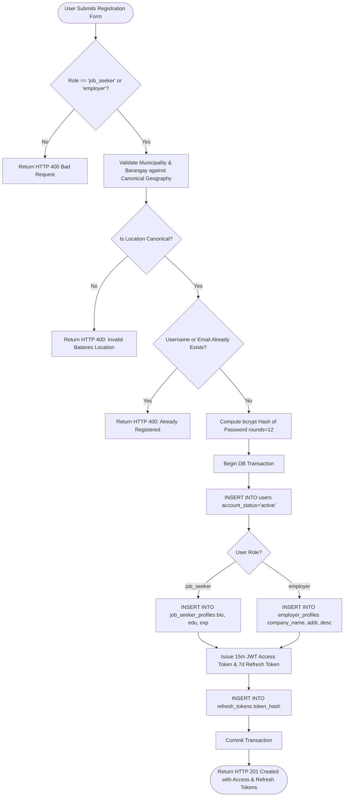
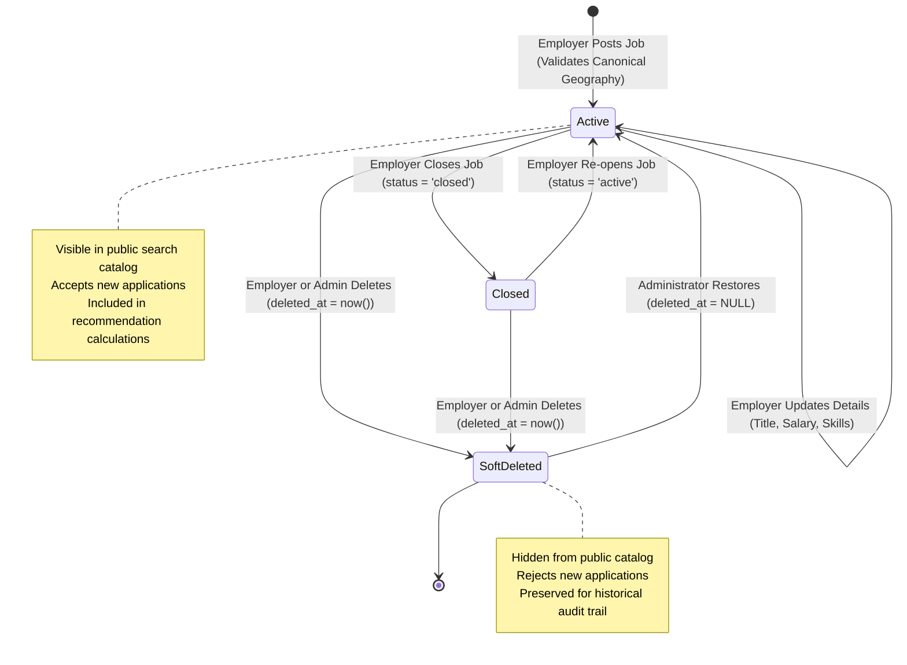
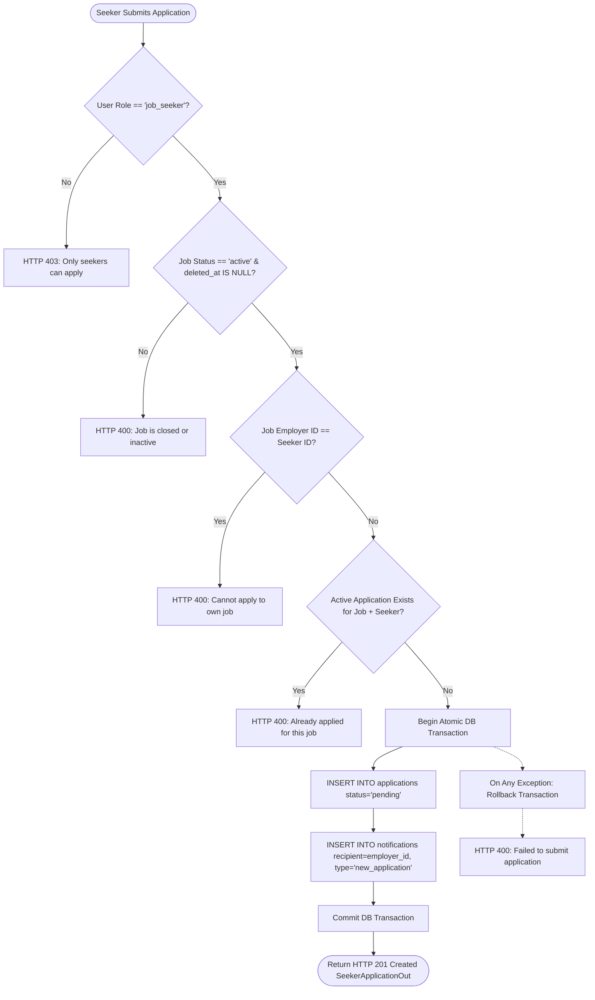
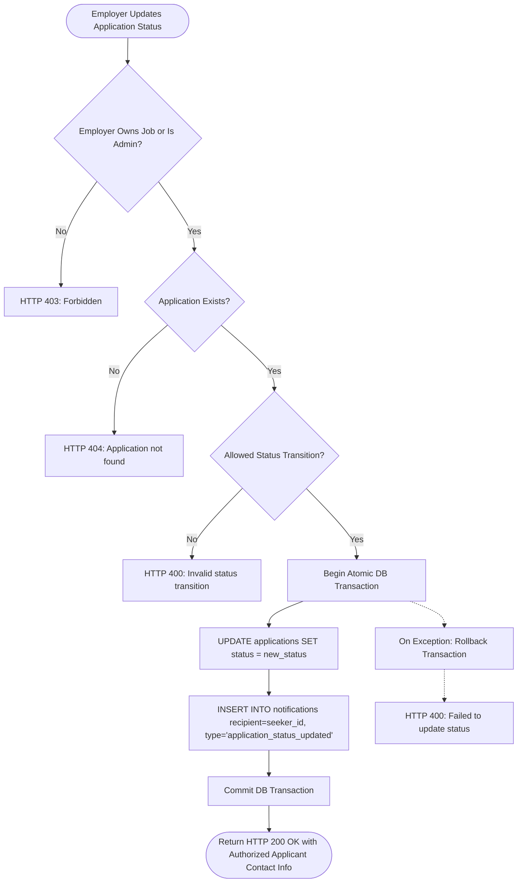
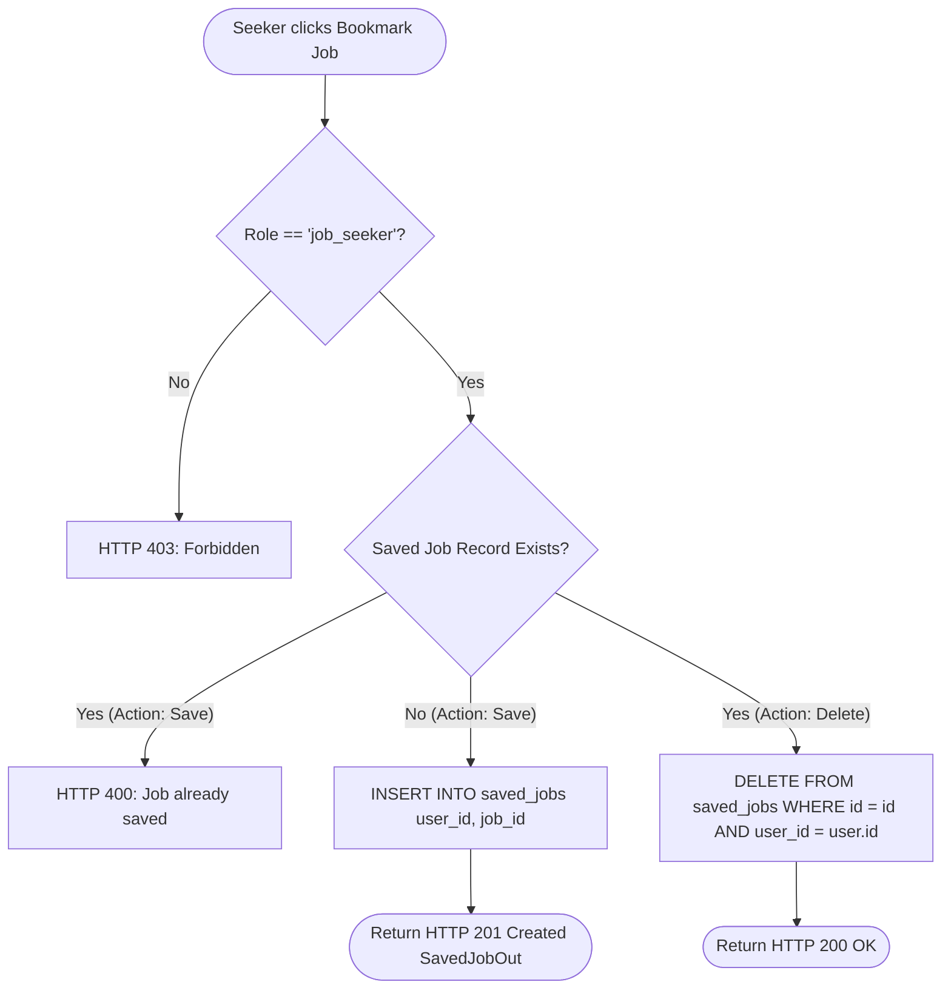
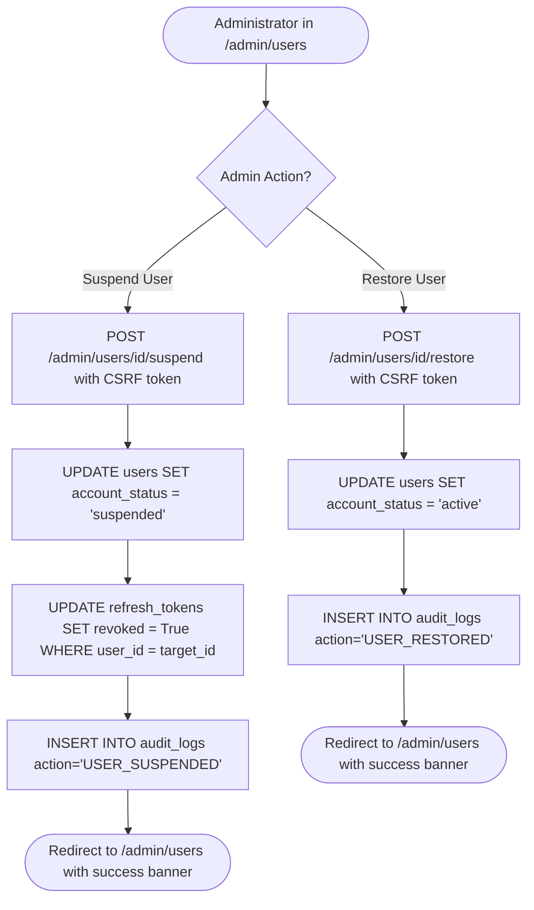

# 08 - Business Workflows

## 1. Overview of Core Workflows

The **Batanes Niche Job Portal** manages all platform interactions through deterministic, auditable business workflows. This document details the step-by-step logic, transaction boundaries, and state transitions for all core operations.

---

## 2. User Registration Workflow

Public registration accommodates both job seekers and local employers while enforcing canonical location validation and role-specific profile entity generation.

---

## 3. Job Posting Lifecycle Workflow

Employers create, update, and manage vacancies. Vacancy availability is controlled via status and soft-deletion.

---

## 4. Job Application Submission & Notification Workflow

Job application submission is governed by an **Explicit Transaction Boundary** that couples application persistence with instant employer notification.

---

## 5. Application Status Transition & Applicant Notification Workflow

Employers review applications and update candidate statuses (`pending` -> `accepted` / `rejected`). Each status change atomically notifies the candidate.

### Permitted Status Transitions
- `pending` -> `accepted` (Applicant approved for hiring)
- `pending` -> `rejected` (Applicant not selected)
- `accepted` -> `pending` (Status re-opened for evaluation)
- `rejected` -> `pending` (Application reconsidered)

---

## 6. Password Reset via 6-Digit Email OTP Workflow

Ensures zero account enumeration, brute-force defense, and automated session invalidation.

```mermaid
flowchart TD
    subgraph Phase1["Phase 1: OTP Dispatch"]
        UserReq([User Requests Reset with Email]) --> FindUser{Active User Exists?}
        FindUser -- No --> SilentSuccess[Return HTTP 200 Generic Message]
        FindUser -- Yes --> InvalidateOld[Set used=True on existing active OTPs for user]
        InvalidateOld --> GenOTP[Generate CSPRNG 6-digit OTP]
        GenOTP --> HashOTP[Compute bcrypt hash of OTP]
        HashOTP --> SaveResetToken[INSERT INTO password_reset_tokens expires_at=now+15m, attempts=0]
        SaveResetToken --> DispatchEmail[EmailDeliveryService: Send OTP via SMTP]
        DispatchEmail --> ReturnGeneric([Return HTTP 200 Generic Message])
    end

    subgraph Phase2["Phase 2: OTP Verification & Password Update"]
        SubmitNew([User Submits Email, OTP Code, New Password]) --> GetToken{Active Reset Token Exists?}
        GetToken -- No --> ErrToken[HTTP 400: Invalid or expired reset code]
        GetToken -- Yes --> VerifHash{verify_otp code, stored_hash?}
        
        VerifHash -- No --> IncAttempts[attempts_count += 1]
        IncAttempts --> AttemptCheck{attempts_count >= 5?}
        AttemptCheck -- Yes --> ErrLockout[HTTP 400: Too many failed attempts. Code invalidated]
        AttemptCheck -- No --> ErrInvalid[HTTP 400: Invalid or expired reset code]
        
        VerifHash -- Yes --> BeginAtomic[Begin Atomic DB Transaction]
        BeginAtomic --> UpdPwd[UPDATE users SET password_hash = bcrypt new_password]
        UpdPwd --> MarkUsed[UPDATE password_reset_tokens SET used = True]
        MarkUsed --> TermSessions[UPDATE refresh_tokens SET revoked = True WHERE user_id = user.id]
        TermSessions --> LogAudit[INSERT INTO audit_logs action='PASSWORD_RESET_COMPLETE']
        LogAudit --> CommitAtomic[Commit Transaction]
        CommitAtomic --> Done([Return HTTP 200 OK: Password successfully reset])
    end
```

---

## 7. Saved Jobs (Bookmarks) Workflow

Job seekers bookmark vacancies for future reference.

---

## 8. Administrative User Moderation Workflow

Administrators can search, inspect, suspend, and restore platform accounts via the Jinja2 interface.

---

## 9. Next Steps

- For mathematical formulas and calculation steps of the recommendation algorithm, see [**09-Recommendation-Engine.md**](./09-Recommendation-Engine.md).
- To examine how the frontend React SPA renders these workflows, see [**10-Frontend-Architecture.md**](./10-Frontend-Architecture.md).
- For complete operational coverage of the administrative portal, see [**11-Administrative-UI.md**](./11-Administrative-UI.md).
