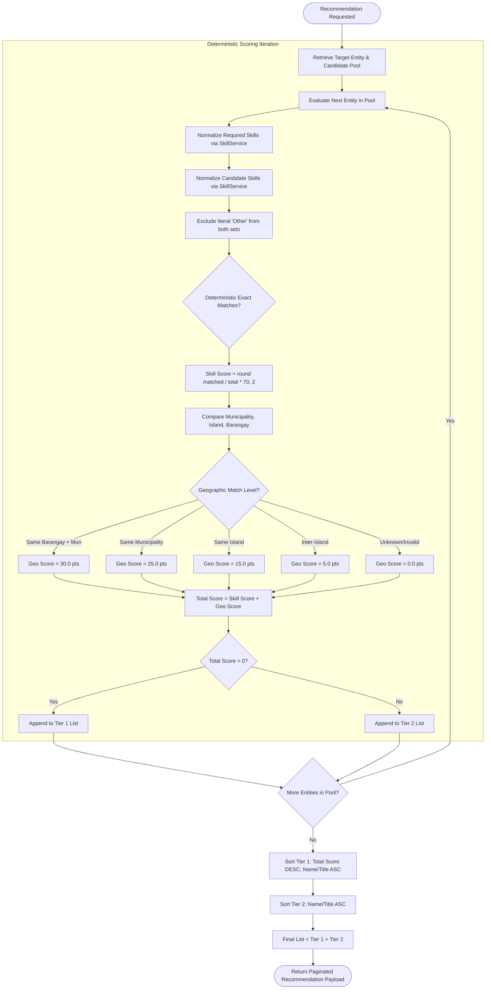

# 09 - Recommendation Engine

## 1. Engine Design Philosophy & Determinism

The **Batanes Niche Recommendation Engine** is engineered to be **100% deterministic, explainable, and reproducible**.

In a fragile island economy like Batanes, opaque machine learning models or black-box neural networks introduce significant operational hazards:
- They can unfairly penalize trade workers who do not use modern corporate resume phrasing.
- They fail to account for the physical reality of island water channels and sea crossings.
- They cannot explain to a local employer or municipal administrator *why* a candidate was recommended.

The portal's engine eliminates these hazards by implementing a **Two-Component Mathematical Scoring Formula (0 to 100 points)** paired with a **Two-Tier Sorting Mechanism**.

---

## 2. Mathematical Scoring Model

```
Total Recommendation Score = Skill Match Score (0 - 70) + Geographic Distance Score (0 - 30)
```

The maximum possible score is **100.00 points**, with 70% weighted toward trade and vocational competency and 30% weighted toward transit accessibility.

---

## 3. Skill Match Scoring (0.0 to 70.0 Points)

The skill matching algorithm (`RecommendationService.calculate_skill_score`) evaluates the overlap between candidate trade skills and job requirements.

### Algorithm Specifications
1. **Tokenization & Normalization**:
   - Both strings (`job.required_skills` and `candidate.skills`) are split by commas (`,`).
   - Each token is stripped of leading/trailing whitespace and all internal runs of whitespace are collapsed to a single space (`re.sub(r"\s+", " ", ...)`).
   - Each token is converted to lowercase via `str.casefold()`.
   - Empty tokens are discarded.
   - Canonical skill values are resolved through `normalize_skill_values` before comparison (see `SkillService`).
   - The literal value `"other"` (case-insensitive) is **silently excluded** from both required and candidate token sets before comparison, preventing false positive matches.
2. **Edge Cases**:
   - If the job listing lists **no required skills** (empty token set after normalization): Returns `0.0` points.
   - If the candidate profile lists **no skills**: Returns `0.0` points.
3. **Deterministic Exact Matching**:
   - A required skill token is considered satisfied if and only if its normalized form appears **exactly** in the candidate's normalized token set.
   - Matching is exact — no substring logic, fuzzy matching, semantic similarity, or embeddings are used.
   - Example: Required `"customer service"` matches candidate `"Customer Service"` (normalized to same value).
   - Example: Required `"tourism & tour guiding"` does **not** match candidate `"tour guiding"` — the tokens must normalize identically.
   - Custom values are compared by their exact normalized text; they match only if the candidate stored the identical custom value.
4. **Proportional Scoring Formula**:
   $$\text{Skill Score} = \text{round}\left( \frac{\text{Count of Matched Required Skills}}{\text{Total Count of Required Skills}} \times 70.0, \, 2 \right)$$

---

## 4. Geographic Distance Scoring (0.0 to 30.0 Points)

The geographic scoring algorithm (`GeographyService.score_distance` / `calculate_geographic_score`) models physical transit accessibility across Batanes.

| Geographic Relationship | Points Awarded | Operational Transit Rationale |
|---|:---:|---|
| **Same Barangay + Same Municipality** | **30.0 pts** | **Hyper-Local Walking/Cycling Match**: Candidate and workplace reside within the exact same barangay. Zero transit friction. |
| **Same Municipality (Different / Unspecified Barangay)** | **25.0 pts** | **Same Municipal Jurisdiction**: Short tricycle or motorcycle ride along municipal roads. Commute unaffected by sea conditions. |
| **Same Island (Different Municipality)** | **15.0 pts** | **Intra-Island Transit**: Accessible via national highway on Batan Island (e.g., Basco to Mahatao or Ivana). No sea crossing. |
| **Inter-Island (Different Islands in Batanes)** | **5.0 pts** | **Inter-Island Sea Crossing Required**: Crosses open waters (e.g., Batan to Sabtang or Itbayat). Commute subject to boat schedules and monsoons. |
| **Unknown or Invalid Location** | **0.0 pts** | Location outside canonical Batanes hierarchy or unvalidated. |

---

## 5. Two-Tier Sorting Architecture

After scoring, candidates or jobs are partitioned into **Two Distinct Tiers**:

```
+---------------------------------------------------------------------------------+
|                                 TIER 1 (Score > 0)                              |
|   Active Matches: Ranked strictly by Total Score DESC, then Name/Title ASC       |
+---------------------------------------------------------------------------------+
                                         |
+---------------------------------------------------------------------------------+
|                                 TIER 2 (Score == 0)                             |
|   Zero-Match Pool: Ranked alphabetically by Name/Title ASC                      |
+---------------------------------------------------------------------------------+
```

### Purpose of Two-Tier Grouping
- **Tier 1** ensures that any candidate or job with genuine skill overlap or geographic relevance is surfaced at the top of the search results, ordered by relevance.
- **Tier 2** guarantees that zero-match candidates or jobs are not completely hidden or discarded; they remain discoverable at the end of the list in predictable alphabetical order.

---

## 6. Calculation Walkthroughs & Examples

### Example 1: Job Seeker Evaluating a Tour Guide Vacancy

**Job Requirements**:
- **Title**: *Heritage Tour Coordinator*
- **Location**: Basco, Batan Island (Barangay: *Kayvaluganan*)
- **Required Skills**: `"Tourism & Tour Guiding, Customer Service, First Aid"` (3 skills total)

**Candidate Profile (Juan Abad)**:
- **Location**: Basco, Batan Island (Barangay: *San Antonio*)
- **Skills**: `"Tour Guiding, Customer Service, Arc Welding"`

#### Step 1: Skill Score Calculation
- Required tokens (normalized): `["tourism & tour guiding", "customer service", "first aid"]` (3 skills)
- Candidate tokens (normalized): `["tour guiding", "customer service", "arc welding"]`
- Deterministic exact matching:
  1. `"tourism & tour guiding"` vs. candidate set → `"tour guiding"` is **not** an exact match → **No match**
  2. `"customer service"` vs. candidate set → exact match → **Matched**
  3. `"first aid"` vs. candidate set → **No match**
- Overlap count: 1 out of 3 skills
- Skill Score = $\text{round}((1 / 3) \times 70.0, 2) = \text{round}(23.333..., 2) =$ **23.33 points**.

#### Step 2: Geographic Score Calculation
- Job Location: Basco / Kayvaluganan (Batan Island)
- Candidate Location: Basco / San Antonio (Batan Island)
- Comparison: Same Municipality (Basco), but different barangays.
- Geographic Score = **25.0 points**.

#### Step 3: Total Score & Tier Placement
- Total Score = $23.33 + 25.0 =$ **48.33 points**.
- Tier Placement: **Tier 1** (Score > 0).

---

### Example 2: Inter-Island Hospitality Candidate

**Job Requirements**:
- **Title**: *Lodge Front Desk Assistant*
- **Location**: Basco, Batan Island (Barangay: *San Antonio*)
- **Required Skills**: `"Hotel & Hospitality, Customer Service"` (2 skills total)

**Candidate Profile (Elena Hornedo)**:
- **Location**: Sinakan, Sabtang Island
- **Skills**: `"Hotel & Hospitality, Customer Service, Cooking"`

#### Step 1: Skill Score Calculation
- Required tokens: `["hotel & hospitality", "customer service"]` (2 skills)
- Candidate tokens: `["hotel & hospitality", "customer service", "cooking"]`
- Matches: Both required skills matched (2 out of 2).
- Skill Score = $(2 / 2) \times 70.0 =$ **70.0 points**.

#### Step 2: Geographic Score Calculation
- Job Location: Basco, Batan Island
- Candidate Location: Sinakan, Sabtang Island
- Comparison: Inter-island (Batan Island vs. Sabtang Island).
- Geographic Score = **5.0 points**.

#### Step 3: Total Score & Ranking
- Total Score = $70.0 + 5.0 =$ **75.00 points**.
- Tier Placement: **Tier 1** (Score > 0).
- Despite requiring a sea crossing, Elena's perfect skill alignment places her near the top of the applicant pool with 75.00 points.

---

## 7. Mermaid Recommendation Pipeline



---

## 8. Next Steps

- To see how the React frontend renders recommendation badges, see [**10-Frontend-Architecture.md**](./10-Frontend-Architecture.md).
- To inspect canonical municipality and barangay lists, see [**13-Geography-and-Reference-Data.md**](./13-Geography-and-Reference-Data.md).
- For unit and integration tests covering the recommendation engine, see [**14-Testing-and-Quality.md**](./14-Testing-and-Quality.md).
