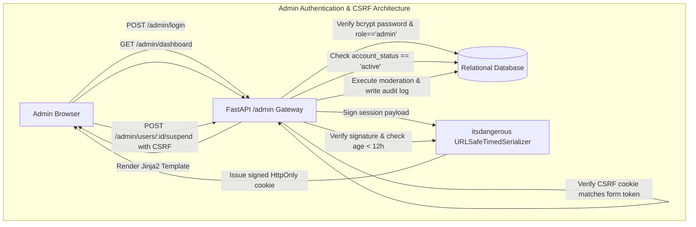

# 11 - Administrative UI

## 1. Architectural Isolation & Rationale

The administrative interface of the **Batanes Niche Job Portal** is entirely decoupled from the public React Single Page Application. It is built as a **Server-Side Rendered (SSR) web portal** using **Jinja2 templates** hosted directly by the FastAPI backend under `/admin`.

### Why Server-Side Rendering for Administration?
1. **Zero Bundle Leakage**: Administrative code, moderation forms, and privileged route names are never packaged into client JavaScript bundles downloaded by public users.
2. **Reduced Attack Surface**: Does not expose raw administration endpoints over the public REST API; administrative actions are strictly bound to authenticated HTTP session cookies and CSRF tokens.
3. **Operational Simplicity**: System operators can inspect and moderate the platform even if the frontend build pipeline or CDN encounters an outage.

---

## 2. Admin Security Architecture



### 2.1 Signed Session Cookie (`batanes_admin_session`)
- Administrative sessions do not use bearer tokens.
- Authentication is tracked via an `HttpOnly`, `SameSite=Lax` cookie named `batanes_admin_session`.
- The cookie payload is cryptographically signed and timestamped using `itsdangerous.URLSafeTimedSerializer` with `settings.ADMIN_SESSION_SECRET`.
- **Session Expiration**: Hard limit of **12 hours** (`max_age = 43200` seconds). Expired cookies are automatically rejected.
- **Immediate Suspension Guard**: On every page request, `verify_admin_session` queries the database for the user record. If `account_status != 'active'`, the session is terminated immediately and redirected to login.

### 2.2 Double-Submit CSRF Defense (`batanes_admin_csrf`)
- All state-modifying administrative actions (`POST /admin/*`) are protected against Cross-Site Request Forgery (CSRF).
- A 32-byte cryptographic token is issued via the `batanes_admin_csrf` cookie and injected into hidden form inputs (`<input type="hidden" name="csrf_token" value="{{ csrf_token }}">`).
- Handlers verify that the form token strictly matches the cookie value using constant-time string comparison (`secrets.compare_digest`).

---

## 3. Administrative Screen Catalog

### 3.1 Login Screen (`/admin/login`)
- Dedicated administrative entry point.
- Renders a clean, branded form requiring username/email and password.
- Rate-limited to prevent automated brute-force attacks.

### 3.2 System Metrics Dashboard (`/admin` or `/admin/dashboard`)
- High-level platform health and volume indicators:
  - **Total Registered Users**: Broken down by seekers and employers.
  - **Active Job Postings**: Count of available vacancies across Batanes.
  - **Total Applications Submitted**: Aggregate application volume.
  - **System Errors (Last 24h)**: Count of unhandled 500 exceptions.
  - **Quick Links**: Direct navigation to users, jobs, error logs, and audit trails.

### 3.3 User Moderation Directory (`/admin/users`)
- Searchable directory of all platform users.
- Filters by role (`job_seeker`, `employer`, `admin`) and standing (`active`, `suspended`).
- **Moderation Actions**:
  - **Suspend Account**: Sets `account_status = 'suspended'`, revokes all active refresh tokens, terminates active sessions, and logs an audit record.
  - **Restore Account**: Sets `account_status = 'active'` and logs an audit record.

### 3.4 Job Vacancy Audit Screen (`/admin/jobs`)
- Lists all vacancies with employer name, location, salary range, and status.
- **Audit Actions**:
  - **Disable Vacancy**: Applies a soft-delete timestamp (`deleted_at = utcnow()`), instantly removing it from public search.
  - **Restore Vacancy**: Clears the soft-delete timestamp (`deleted_at = NULL`), restoring public visibility.

### 3.5 System Error Reports (`/admin/errors`)
- Displays records captured by `ErrorLoggingService`.
- Shows timestamp, associated username, endpoint, and error message.
- Clickable modal reveals the sanitized Python stack trace and scrubbed request payload for root-cause debugging.

### 3.6 Append-Only Audit Trail (`/admin/audit`)
- Immutable compliance record of all privileged platform events.
- Displays timestamp, actor ID/role, IP address, action code, target type/ID, and sanitized JSON details.

---

## 4. Provisioning Administrative Accounts

Admin accounts cannot be registered via public registration. They must be provisioned via the server management CLI:

```bash
# Execute from within the backend directory
cd backend
python -m app.cli create-admin \
  --username sysadmin \
  --email admin@batanesniche.ph \
  --password "YourSecureAdminPassword123!" \
  --full-name "Provincial Administrator"
```

The CLI:
1. Validates that the username and email are not already registered.
2. Hashes the password using bcrypt with work factor 12.
3. Inserts the user with `role = 'admin'` and `account_status = 'active'`.

---

## 5. Next Steps

- For details on transactional notifications coupled with applications, see [**12-Notifications-and-Applications.md**](./12-Notifications-and-Applications.md).
- To examine canonical geography and reference data, see [**13-Geography-and-Reference-Data.md**](./13-Geography-and-Reference-Data.md).
- For local operational procedures, see [**17-Developer-Guide.md**](./17-Developer-Guide.md).
