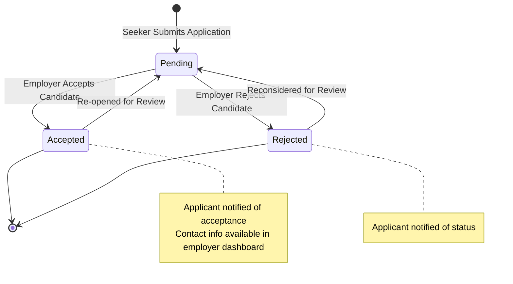

# 12 - Notifications and Applications

## 1. Transactional Coupling Architecture

In the **Batanes Niche Job Portal**, the job application lifecycle and the notification engine are coupled within **Explicit Database Transaction Boundaries**.

When a user submits an application or an employer modifies an applicant's status, the state change and the recipient notification are inserted or updated **atomically** in the same transaction. If notification generation fails, the entire transaction is rolled back, preventing orphaned state changes or silent omissions.

```
+-----------------------------------------------------------------------------------+
|                           EXPLICIT TRANSACTION BOUNDARY                           |
|                                                                                   |
|   1. Verify preconditions (Role, Job Active, Non-duplicate, Allowed transition)   |
|   2. Execute application table mutation (INSERT or UPDATE)                        |
|   3. Insert corresponding notification record into notifications table            |
|   4. Commit transaction (or Rollback on any failure)                              |
+-----------------------------------------------------------------------------------+
```

---

## 2. Application Submission Workflow

Job application submission is implemented in `ApplicationService.submit_application`:

### Precondition Checks
1. **Role Check**: Verifies `current_user.role == 'job_seeker'`. Employers and guests are rejected with `HTTP 403 Forbidden`.
2. **Job Status Check**: Verifies target job exists, has `status == 'active'`, and `deleted_at IS NULL`. Closed or deleted jobs are rejected with `HTTP 400 Bad Request`.
3. **Self-Application Check**: Verifies `job.employer_id != seeker.id`. Users cannot apply to their own job listings (`HTTP 400 Bad Request`).
4. **Duplicate Application Prevention**: Verifies via `ApplicationRepository.has_active_application(db, job_id, seeker_id)` and the database unique constraint `uq_applications_job_seeker`. Duplicate attempts are rejected with `HTTP 400 Bad Request: You have already applied for this job.`

### Transaction Boundary Execution
```python
try:
    # 1. Insert application record
    application = Application(
        job_id=job.id,
        seeker_id=seeker.id,
        cover_letter=app_data.cover_letter.strip() if app_data.cover_letter else None,
        resume_url=app_data.resume_url.strip() if app_data.resume_url else seeker.resume_url,
        status="pending",
    )
    ApplicationRepository.create(db, application)
    db.flush()

    # 2. Insert employer notification
    notification = Notification(
        user_id=job.employer_id,
        title="New Application Received",
        message=f"{seeker.full_name} submitted an application for your job posting: '{job.title}'.",
        type="new_application",
        link="/employer",
    )
    NotificationRepository.create(db, notification)

    # 3. Commit atomic transaction
    db.commit()
    db.refresh(application)
except Exception as exc:
    db.rollback()
    raise HTTPException(status_code=400, detail=f"Failed to submit application: {exc}")
```

---

## 3. Application Status State Machine & Transitions

Employers manage applicant progress through a validated state machine (`ApplicationService.update_application_status`):



### Transition Enforcement Rules
- Allowed transitions from `pending`: `accepted`, `rejected`.
- Allowed transitions from `accepted`: `pending`.
- Allowed transitions from `rejected`: `pending`.
- Any transition not defined in the transition map is rejected with `HTTP 400 Bad Request: Invalid status transition from '{current}' to '{new}'.`

### Transaction Boundary on Status Update
```python
try:
    application.status = new_status
    ApplicationRepository.update(db, application)

    # Atomic Notification for Applicant
    status_text = "accepted" if new_status == "accepted" else ("rejected" if new_status == "rejected" else "marked pending")
    notification = Notification(
        user_id=application.seeker_id,
        title="Application Status Updated",
        message=f"Your application for '{application.job.title}' was {status_text}.",
        type="application_status_updated",
        link="/dashboard",
    )
    NotificationRepository.create(db, notification)

    db.commit()
    db.refresh(application)
except Exception as exc:
    db.rollback()
    raise HTTPException(status_code=400, detail=f"Failed to update application status: {exc}")
```

---

## 4. Applicant Contact Revelation Rules

To balance candidate privacy with hiring utility:
1. **Public Search Masking**: In the public candidate directory (`/api/v1/users/job-seekers`), seeker emails and phone numbers are strictly withheld.
2. **Authorized Revelation**: When an employer lists received applications (`GET /api/v1/applications`), `ApplicationService._to_employer_application_out` verifies that the current user owns the associated job. If verified, the system materializes the full `EmployerApplicantProfile`:
   - `email`: Direct candidate email address.
   - `phone_number`: Candidate telephone/mobile number.
   - `resume_url`: Candidate resume PDF URL.
   - Complete vocational background (skills, experience years, education, bio).

---

## 5. In-App Notification System

In-app notifications provide non-intrusive, persistent communication between applicants and employers.

### Notification Entity Schema
- `id`: Primary key.
- `user_id`: Foreign key referencing the receiving user.
- `title`: Concise notification header (e.g., *"New Application Received"*).
- `message`: Contextual description including job title and counterparty name.
- `type`: Taxonomy code (`new_application`, `application_status_updated`).
- `link`: Client-side SPA route for direct navigation (`/employer` or `/dashboard`).
- `is_read`: Boolean flag (default `False`).
- `created_at`: Timestamp.

### Read Management
- **Retrieve Feed**: `GET /api/v1/notifications?limit=50&offset=0` returns notifications sorted by `created_at DESC`.
- **Acknowledge All**: `POST /api/v1/notifications/read` bulk-updates all unread notifications for the authenticated user (`UPDATE notifications SET is_read = True WHERE user_id = :id AND is_read = False`).

---

## 6. Communication Scope Boundaries (Version 2)

Version 2 explicitly intentionally omits real-time instant messaging and chat:
- **No Direct Chat**: Communication occurs via the application status state machine and persistent notifications.
- **Direct Offline Contact**: Once an application is submitted, employers are authorized to contact applicants directly via standard telephone or email using the authorized contact details.

---

## 7. Next Steps

- For canonical geography rules and distance calculations, see [**13-Geography-and-Reference-Data.md**](./13-Geography-and-Reference-Data.md).
- To inspect unit tests for applications and duplicate checks, see [**14-Testing-and-Quality.md**](./14-Testing-and-Quality.md).
- For local seeding procedures, see [**17-Developer-Guide.md**](./17-Developer-Guide.md).
