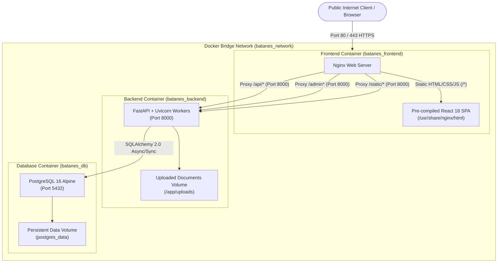

# 15 - Deployment and Operations

## 1. Production Architecture Topology

The **Batanes Niche Job Portal** is deployed as an orchestrated multi-container application using **Docker Compose** fronted by **Nginx** and backed by **PostgreSQL 16**.



---

## 2. Nginx Reverse Proxy Configuration (`docker/nginx.conf`)

Nginx operates as the reverse proxy gateway, SSL termination endpoint, and static asset server.

### Path Routing Rules
| Incoming Request Path | Target Handler | Caching & Compression Policy |
|---|---|---|
| `/assets/*` | Nginx local disk | `Cache-Control: public, max-age=31536000, immutable`. Fingerprinted build assets. |
| `/api/*` | Proxy to `backend:8000` | No cache. Gzip enabled for JSON payloads. Pass `X-Forwarded-For`, `X-Real-IP`. |
| `/admin*` | Proxy to `backend:8000` | No cache. Server-rendered Jinja2 HTML. Pass `Host`, `Cookie`, `X-Real-IP`. |
| `/static/*` | Proxy to `backend:8000` | Serves uploaded user avatars and public assets. |
| `/health` | Nginx internal | Returns HTTP 200 `"healthy\n"`. Internal proxy health check. |
| `/*` (All other paths) | Nginx local disk | Fallback to `/index.html` (`try_files $uri $uri/ /index.html`). No-cache headers. |

### Production Security Headers
```nginx
add_header X-Frame-Options "SAMEORIGIN" always;
add_header X-Content-Type-Options "nosniff" always;
add_header X-XSS-Protection "1; mode=block" always;
add_header Referrer-Policy "strict-origin-when-cross-origin" always;
add_header Permissions-Policy "camera=(), microphone=(), geolocation=()" always;
```

---

## 3. Docker Containerization Architecture

### 3.1 Backend Dockerfile (`docker/backend.Dockerfile`)
- **Base Image**: `python:3.11-slim`.
- **System Dependencies**: Installs `libpq-dev`, `gcc`, and `curl` for database drivers and container healthchecks.
- **Security**: Creates an unprivileged system user (`appuser`, UID 1001) to run the Python application.
- **Healthcheck**: Probes `http://localhost:8000/health` every 20 seconds.
- **Entrypoint**: Runs `uvicorn app.main:app --host 0.0.0.0 --port 8000`.

### 3.2 Frontend Dockerfile (`docker/frontend.Dockerfile`)
- **Multi-Stage Build**:
  1. **Build Stage (`node:20-alpine`)**: Runs `npm install` and `npm run build` to compile the React TypeScript application into optimized static assets (`dist/`).
  2. **Runtime Stage (`nginx:1.27-alpine`)**: Copies compiled assets from build stage to `/usr/share/nginx/html` and deploys `docker/nginx.conf`.
- **Port Exposure**: Exposes Port 80 for reverse proxy traffic.

---

## 4. Production Environment Configuration (`.env`)

The application consumes configuration variables via `backend/app/core/config.py`.

```env
# ============================================================
# Batanes Niche Job Portal - Production Configuration
# ============================================================

ENVIRONMENT=production
DEBUG=False
APP_NAME="Batanes Niche Job Portal"
BASE_URL=https://batanesjobs.ph

# Relational Database Connection (PostgreSQL 16)
DATABASE_URL=postgresql+asyncpg://batanes_user:REPLACE_WITH_HIGH_ENTROPY_PASSWORD@db:5432/batanes_niche
POSTGRES_DB=batanes_niche
POSTGRES_USER=batanes_user
POSTGRES_PASSWORD=REPLACE_WITH_HIGH_ENTROPY_PASSWORD

# Cryptographic Keys (Minimum 64 characters)
JWT_SECRET_KEY=REPLACE_WITH_HIGH_ENTROPY_HEX_KEY_MINIMUM_64_CHARACTERS
ADMIN_SESSION_SECRET=REPLACE_WITH_HIGH_ENTROPY_HEX_KEY_MINIMUM_64_CHARACTERS

# Token Lifecycles
ACCESS_TOKEN_EXPIRE_MINUTES=15
REFRESH_TOKEN_EXPIRE_DAYS=7

# CORS Allowed Origins (Comma-separated or JSON list)
ALLOWED_ORIGINS=https://batanesjobs.ph

# SMTP Mail Relay (For Password Reset OTP Delivery)
MAIL_HOST=smtp.gmail.com
MAIL_PORT=587
MAIL_USERNAME=notifications@batanesjobs.ph
MAIL_PASSWORD=REPLACE_WITH_SMTP_APP_PASSWORD
MAIL_FROM=noreply@batanesjobs.ph
MAIL_FROM_NAME="Batanes Niche Job Portal"
MAIL_STARTTLS=True
MAIL_SSL_TLS=False
```

---

## 5. Database Migrations & Operational Upgrades

Database migrations are executed through **Alembic** within the running backend container:

```bash
# Apply all pending database schema migrations
docker compose exec backend alembic upgrade head

# Verify migration status
docker compose exec backend alembic current
```

---

## 6. Health & Readiness Probes

The backend exposes two specialized monitoring endpoints:

1. **Liveness Probe (`GET /health`)**:
   - Returns `{"status": "healthy"}`.
   - Verifies the ASGI server is accepting HTTP requests.
2. **Readiness Probe (`GET /ready`)**:
   - Executes an active database query (`SELECT 1`).
   - If the database is connected: Returns HTTP 200 `{"status": "ready", "database": "connected"}`.
   - If the database is unreachable: Returns HTTP 503 `{"status": "degraded", "database": "disconnected"}`.

---

## 7. Database Backup and Disaster Recovery Runbook

### 7.1 Automated Daily Database Backup
```bash
# Execute pg_dump from host machine
TIMESTAMP=$(date +"%Y%m%d_%H%M%S")
docker compose exec -T db pg_dump -U batanes_user batanes_niche | gzip > /opt/backups/batanes_db_${TIMESTAMP}.sql.gz
```

### 7.2 Database Restoration
```bash
# Decompress and restore from backup file
gunzip < /opt/backups/batanes_db_20260904_120000.sql.gz | docker compose exec -T db psql -U batanes_user -d batanes_niche
```

---

## 8. Next Steps

- For the full 19-step production deployment manual, see [`development/setup/PRODUCTION_SETUP.md`](file:///c:/Users/Jonathea%20Gabotero/Documents/GitHub/Batanes_Niche/development/setup/PRODUCTION_SETUP.md).
- For data analyst reference and operational reporting SQL, see [**16-Data-Analysis-Reference.md**](./16-Data-Analysis-Reference.md).
- For local development onboarding, see [**17-Developer-Guide.md**](./17-Developer-Guide.md).
